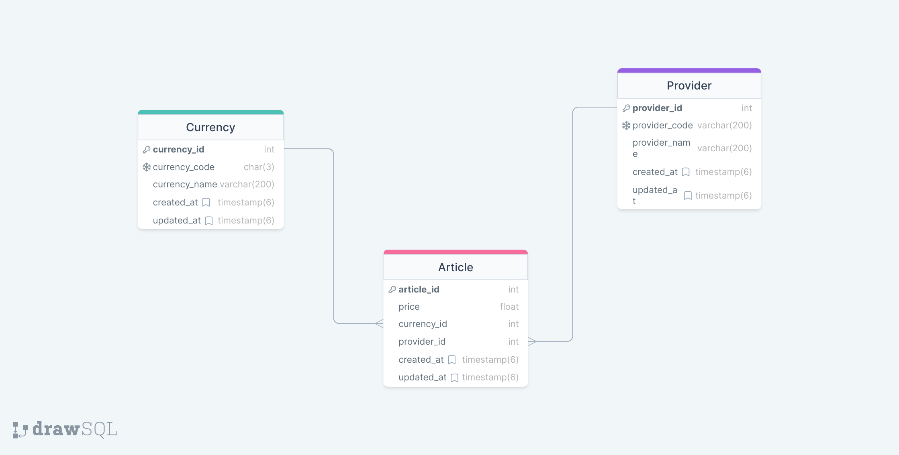

## Questions:
## 1. What kind of problems or disadvantages may occur in the handling/maintenance of this list (imagine, that a real-world list like this would contain thousands of entries)?

### Answer
1. Handling and maintaining a list like this with thousands of entries could pose several challenges:

   a. **Data Integrity**: Ensuring that each entry is accurate and consistent can be difficult, especially if multiple people are responsible for updating the list. Mistakes in article numbers, provider names, or prices could lead to errors in transactions.

   b. **Data Redundancy**: The same provider may appear multiple times with slight variations in their name ("Paystack" and "Paystack Inc."). This redundancy can lead to inefficiencies in storage and make it harder to manage and update the data.

   c. **Scalability**: As the list grows, managing and querying the data efficiently becomes more complex. It may require specialized databases or indexing strategies to maintain performance.

   d. **Data Security**: Depending on the sensitivity of the information, security measures need to be in place to prevent unauthorized access or modifications.

   e. **Data Retrieval and Analysis**: Extracting meaningful insights from the list may become challenging due to its flat structure. Aggregating data or performing complex queries may be cumbersome.

   f. **Data Updates**: Updating existing entries or adding new ones might require careful validation to ensure the integrity of the dataset.

## Questions:
## 2. Creating a better data model would involve organizing the information into related entities. 


### Answer
Here's a simplified Entity Relationship Diagram (ERD) for the provided data:
   - **Entities**:

      - Article  (article_id, provider_id, currency_id, price)
      - Provider (provider_id, provider_code, provider_name)
      - Provider (currency_id, currency_code, currency_name)

   - **Relationships**:

      - Each Article is associated with one Provider (1-to-1 relationship).
      - Each Provider can supply multiple Articles (1-to-many relationship).
      - Each Currency can supply multiple Articles (1-to-many relationship).

   - **Attributes**:

      - Article: article_id (Primary Key), currency_id, provider_id, price
      - Provider: provider_id (Primary Key), provider_code, provider_name
      - Currency: currency_id (Primary Key), currency_code, currency_name
   - **ERD Representation**:

     ```
      +-----------------+          +-----------------+          +-----------------+
      |    Article      |          |    Provider     |          |    Currency     |
      +-----------------+          +-----------------+          +-----------------+
      | article_id (PK) |<--+ 1    | provider_id (PK)|    1 --> | currency_id (PK)|
      | price           |          | provider_code   |          | currency_code   |
      | currency_id (FK)|          | provider_name   |          | currency_name   |
      | provider_id (FK)|          |                 |          |                 |
      +-----------------+          +-----------------+          +-----------------+
     ```

   In this improved model, data redundancy is reduced, and relationships between articles and providers are clearly defined. This allows for more efficient querying and maintenance of the dataset.
   

## Questions:
## 3. Explain why your data model is better than the original list. 
### Answer
The improved data model offers several advantages over the original list:

1. **Reduced Data Redundancy**:

   - Original List: The original list contains repetitive information, such as provider names and article details, which can lead to data redundancy and inefficiency.

   - Improved Data Model: By organizing the data into separate tables (Article, Provider, Currency) and establishing relationships, redundant information is minimized. Providers and currencies are stored only once in their respective tables, reducing the risk of inconsistency and saving storage space.

2. **Normalized Structure**:

   - Original List: The original list has a flat structure, which can make it challenging to manage and query the data efficiently, especially as the dataset grows.

   - Improved Data Model: The improved data model follows principles of database normalization. This means that data is organized in a way that minimizes redundancy and dependency. This leads to a more organized and structured dataset, making it easier to maintain and query.

3. **Clear Relationships**:

   - Original List: In the original list, relationships between articles, providers, and currencies are not explicitly defined.

   - Improved Data Model: The relationships between articles, providers, and currencies are clearly defined using foreign keys. This ensures referential integrity, meaning that relationships between entities are maintained accurately.

4. **Ease of Maintenance**:

   - Original List: In a large list, making updates or corrections can be error-prone and time-consuming.

   - Improved Data Model: With a structured data model, making updates is more straightforward. For example, if a provider changes their name, it only needs to be updated in one place (the Provider table), rather than across multiple entries.

5. **Efficient Querying and Analysis**:

   - Original List: Extracting specific information or performing complex queries on a flat list can be challenging.

   - Improved Data Model: With well-defined relationships and normalized data, querying becomes more efficient. For example, retrieving all articles from a specific provider or finding the total price of articles in a specific currency is much simpler.

6. **Scalability**:

   - Original List: As the list grows, managing and querying the data efficiently can become increasingly complex.

   - Improved Data Model: The improved data model is better equipped to handle larger datasets. Well-designed database structures can be optimized for performance, even as the dataset expands.

## Questions:
## 4 Once your better data model has been established, create an SQL query that generates the original list again.
### Answer
This query performs a LEFT JOIN operation on the `Article`, `Currency`, and `Provider` tables, linking them using their respective foreign keys.

```sql
SELECT 
    article_id as article_no,
    currency_name as article,
    provider_name as provider,
    article.provider_id as provider_no,
    price 
FROM 
    article 
LEFT JOIN 
    currency ON article.currency_id = currency.currency_id 
LEFT JOIN 
    provider ON article.provider_id = provider.provider_id;
```

**Performance Benefits over the Original Structure**:

1. **Efficiency in Data Retrieval**:

   - The improved data model with normalized tables allows for more efficient querying. JOIN operations are used to combine information from different tables, resulting in more precise retrieval of data.

2. **Reduced Data Redundancy**:

   - The improved data model reduces data redundancy, which can lead to a more compact and efficient storage of information. This can lead to better disk usage and retrieval times.

3. **Better Maintenance and Updates**:

   - With the improved data model, updates or corrections to specific information (e.g., provider details) are easier and more accurate. This is because data is organized in a structured manner, reducing the risk of inconsistencies.

4. **Enhanced Scalability**:

   - The improved data model is better suited for handling larger datasets. Well-designed database structures can be optimized for performance even as the dataset expands.

5. **Facilitates More Complex Queries**:

   - The normalized data model allows for more complex queries, such as aggregations, grouping, and filtering, which can be crucial for data analysis and reporting.

6. **Maintains Referential Integrity**:

   - The use of foreign key constraints ensures that relationships between entities are maintained accurately. This helps prevent data anomalies and ensures data integrity.

## Questions:
## 5a API Development: Develop a Restful API (CRUD operation) for the information provided and also write an integration test for this API.
### Answer
Here's a brief overview of the endpoints you've described:

1. **List Articles by Provider and Currency with Pagination**:
   - Endpoint: `GET /list` and `GET /`
   - Query Parameters: `start`, `limit`, `filter`
   - Example Query: `?start=0&limit=50&filter=provider:flutterwave&filter=article:GBP`
   - Response:
   ```json
     {
        "status": 200,
        "message": "success",
        "data": {
            "meta": {
                "totalCount": 1
            },
            "items": [
                {
                    "article": "EU \"Pounds\"",
                    "article_no": "0001",
                    "provider": "Flutterwave",
                    "provider_no": "0003",
                    "price": 1000
                }
            ]
        }
    }
   ```

2. **Retrieve Article by ID**:
   - Endpoint: `GET /:article_no`
   - Example Response:
     ```json
     {
        "status": 200,
        "message": "success",
        "data": {
            "article": "EU \"Pounds\"",
            "article_no": "0001",
            "provider": "Flutterwave",
            "provider_no": "0003",
            "price": 1000
        }
    }
     ```

3. **Delete Article by ID**:
   - Endpoint: `DELETE /:article_no`
   - Example Response:
     ```json
     {
        "status": 200,
        "message": "success",
        "data": {
            "article": "EU \"Pounds\"",
            "article_no": "0001",
            "provider": "Flutterwave",
            "provider_no": "0003",
            "price": 1000
        }
    }
     ```
4. **Update Article**:
   - Endpoints: `PUT /:article_no/update` and `PUT /:article_no`
   - Request Payload (Example):
     ```json
     {
        "article": "gbp",
        "provider": "Flutterwave",
        "price": "1000"
    }
     ```
   - Example Response:
     ```json
     {
        "status": 200,
        "message": "success",
        "data": {
            "article": "EU \"Pounds\"",
            "article_no": "0001",
            "provider": "Flutterwave",
            "provider_no": "0003",
            "price": 1000
        }
    }
     ```

5. **Create New Article**:
   - Endpoints: `POST /create` and `POST /`
   - Request Payload (Example):
     ```json
     {
        "article": "GBP",
        "provider": "flutterwave",
        "price": "1000"
    }
     ```
   - Example Response:
     ```json
     {
        "status": 200,
        "message": "success",
        "data": {
            "article": "EU \"Pounds\"",
            "article_no": "0001",
            "provider": "Flutterwave",
            "provider_no": "0003",
            "price": 1000
        }
    }
     ```

6. **Validation Schemas**:
   - `updateValidation` and `storeValidation` are Joi validation schemas to ensure the request payload adheres to the expected format.
7. **Caching**:
While leverages caching and asynchronous concurrency to enhance the performance and efficiency of data retrieval is a good thing. here are few advantages to caching and asynchronous concurrency request.
   **Advantages**:
   1. Reduced Latency: Faster response times for subsequent requests.
   2. Less Load on Services: Reduces load on services, improving scalability.
   3. Improved Scalability: System can handle more concurrent users.
   4. Better Resource Utilization: Efficient use of system resources.
   5. Enhanced User Experience: Users experience smoother, responsive application.
   6. Resilience to Service Failures: Can serve cached data during service downtime.
   7. Flexible Cache Management: Fine-grained control over data caching duration.
   8. Asynchronous Concurrency: Concurrent execution reduces processing time.
   9. Improved Performance at Scale: Efficient handling of a large volume of requests.
```typescript
   // Setting up caching
   const cache = zeroant.getPlugin(CacheManagerPlugin);

   // Concurrently fetch currency and provider data
   const [currency, provider] = await Promise.all([
   // Caching strategy for Currency
   new CacheOrAsyncStrategy<Currency | null>()
      .setKey(`currencies:${data.article}`)
      .setTtl(TtlUtils.oneMinute)
      .setSource(() => currencyService.findByIdOrCode(data.article))
      .exec(cache),
   
   // Caching strategy for Provider
   new CacheOrAsyncStrategy<Provider | null>()
      .setKey(`providers:${data.provider}`)
      .setTtl(TtlUtils.oneMinute)
      .setSource(() => providerService.findByIdOrCode(data.provider))
      .exec(cache)
   ]);
   ```
## Questions:
## 5b API Development: Document your endpoints on Postman and share a link to the documentation. 
### Answer
[POSTMAN DOC](https://documenter.getpostman.com/view/9260774/2s9YR9YsK1)

## Questions:
## 5c API Development: Outline step-by-step instructions on setting up the take-home on a development environment in your README.md file.
### Answer
[Find Readme Here](README.md)